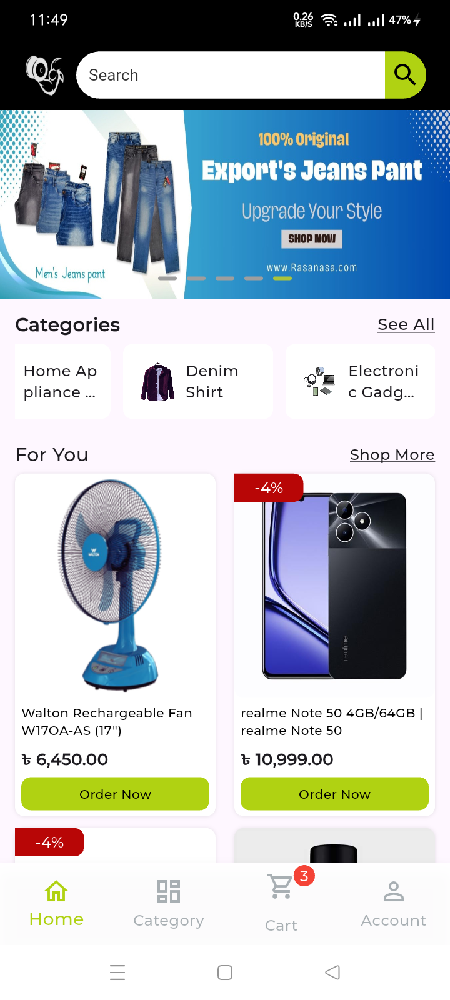
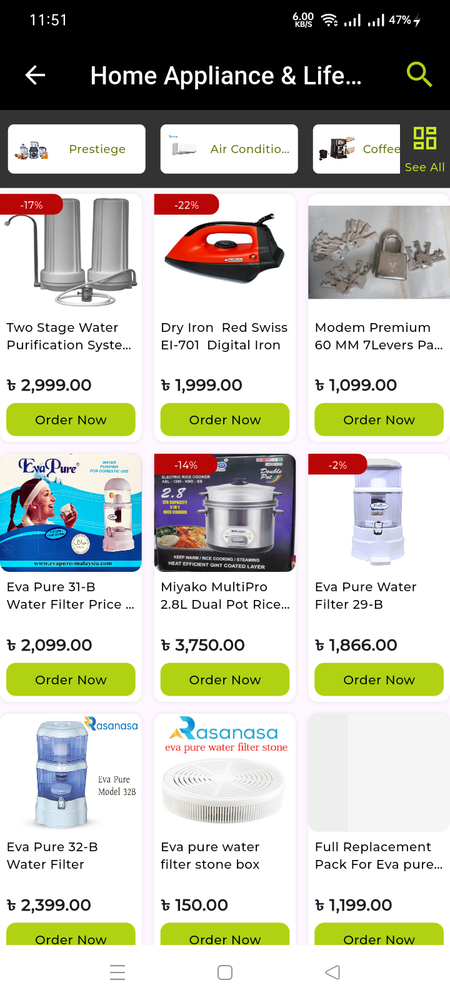
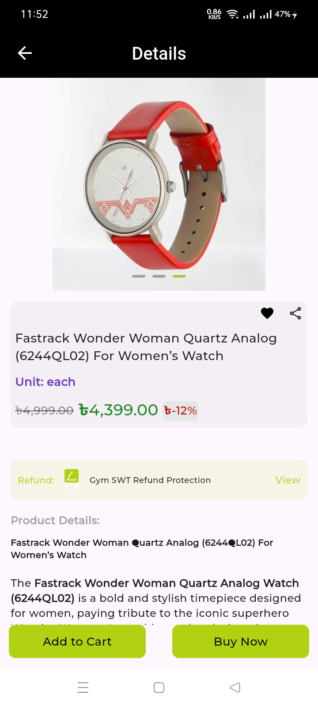
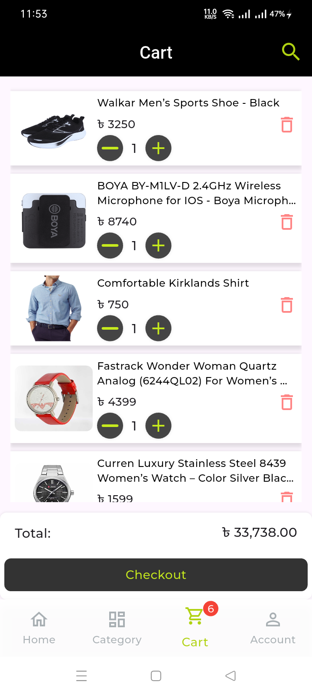
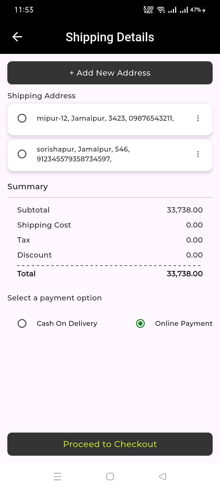
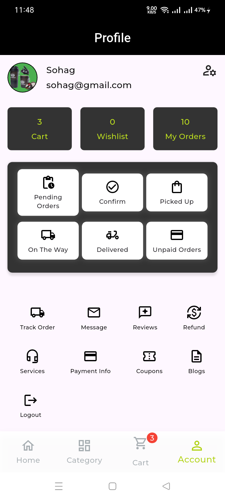

# 🛍️ BD-Mart

BD-Mart is a full-featured **e-commerce mobile application** built with **Flutter** using a strict **Clean Architecture** and `flutter_bloc` for state management.  
The app supports **phone number authentication**, **online payments via SSLCommerz**, and **cash on delivery**, with a modular structure designed for scalability and maintainability.


## ✨ Features

| 🔐 Authentication | 🧭 Bottom Navigation | 👤 Profile | 🛒 Shopping | 💳 Checkout & Orders |
|------------------|-------------------|-----------|------------|--------------------|
| OTP verification using **pinput** | Home – Product feed & banners | Update user info | Product details with carousel images & ratings | Add/manage shipping addresses |
| Session management & validation | Cart – Real-time cart | View past orders & check status | Add/remove items from cart, update quantity | Place orders with **Online Payment (SSLCommerz)** |
|                  | Category – Browse/filter products |           | Instant product search with filtering | Place orders with **Cash on Delivery** |
|                  | Profile – Manage details & order history |           |            | Track order status after purchase |

## 📸 Screenshots

| Home | Category | Product Details | Cart | Checkout | Profile |
|------|---------|------|---------|---------|---------|
|  |  |  |  |  |   |


## 🏗️ Clean Architecture

The project follows a **feature-first, three-layer clean architecture** for easy scaling and testing.

```text
lib/
├─ main.dart
├─ core/
│   ├─ config/app_config.dart     # API endpoints
│   ├─ constants/                 # App-wide constants
│   ├─ entity/                    # Common entities
│   ├─ enums/
│   ├─ error/                     # Error handling (e.g. ServerFailure)
│   ├─ model/                     # Shared models
│   ├─ routes/                    # App routing with go_router
│   ├─ service/                   # API service helpers
│   ├─ theme/                     # Global theme & color schemes
│   ├─ utils/                     # Extensions & utility classes
│   └─ widgets/                   # Reusable widgets
│
├─ features/
│   ├─ address/
│   ├─ auth/
│   ├─ bottom_card/
│   ├─ category/
│   ├─ home/
│   │   ├─ data/                  # Repository implementations & DTOs
│   │   ├─ domain/                # Entities, repository interfaces, use cases
│   │   └─ presentation/          # UI screens, widgets, blocs/cubits
│   ├─ policy/
│   ├─ product/
│   ├─ profile/
│   ├─ search/
│   └─ splash/
└─ service_locator/               # Dependency injection (get_it)
```
> **Every feature** contains the same three layers:
> - **data** – repositories, remote/local data sources, models  
> - **domain** – repositories, entities and use cases  
> - **presentation** – UI, widgets, BLoC/Cubit state management

## 🔐 Environment Variables

Sensitive configuration such as API endpoints and payment credentials are stored in a `.env` file and loaded at runtime with [`flutter_dotenv`](https://pub.dev/packages/flutter_dotenv).

**Example `.env`:**
```env
BASE_URL=https://your-api.example.com
STORE_ID=your_sslcommerz_store_id
STORE_PASSWORD=your_sslcommerz_store_password
```
## 🛠️ Tech Stack

| Area                     | Packages / Tools                                                                                                                                                                                         |
| ------------------------ | -------------------------------------------------------------------------------------------------------------------------------------------------------------------------------------------------------- |
| **Framework**            | Flutter `>=3.5.3`, Dart `>=3.5.3`                                                                                                                                                                        |
| **State Management**     | `flutter_bloc`, `equatable`                                                                                                                                                                              |
| **Routing**              | `go_router`                                                                                                                                                                                              |
| **Dependency Injection** | `get_it`                                                                                                                                                                                                 |
| **Networking**           | `http`, `fpdart`                                                                                                                                                                                         |
| **Storage**              | `shared_preferences`                                                                                                                                                                                     |
| **Payments**             | `flutter_sslcommerz`                                                                                                                                                                                     |
| **UI / UX**              | `flutter_screenutil`, `carousel_slider`, `smooth_page_indicator`, `font_awesome_flutter`, `badges`, `flutter_rating_bar`, `custom_refresh_indicator`, `flutter_spinkit`, `any_image_view`, `dotted_line` |
| **Utilities**            | `fluttertoast`, `flutter_easyloading`, `share_plus`, `flutter_widget_from_html_core`, `pinput`                                                                                                           |
| **Testing**              | `bloc_test`, `mocktail`                                                                                                                                                                                  |
| **Env Management**       | `flutter_dotenv`                                                                                                                                                                                         

## 🚀 Getting Started

### Prerequisites
- **Flutter SDK** `>=3.5.3`  
- **Dart** `>=3.5.3`  
- Android Studio or VS Code  
- Backend API running and reachable

### Clone & Install
```bash
git clone git@github.com:Sohag-84/BD-Mart.git
cd BD-Mart
flutter pub get
```
